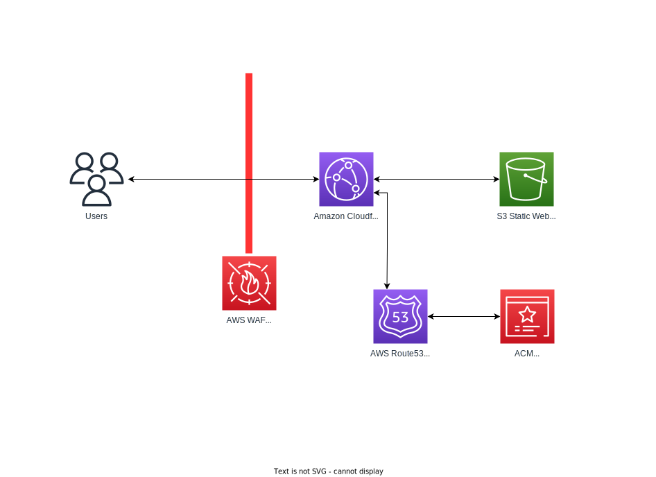

# Sebastian Marynicz Personal Portfolio 
# Infrastructure as Code with Terraform

This is a project making use of AWS and Terraform to host my Resume at [www.sebastianmarynicz.co.uk](https://www.sebastianmarynicz.co.uk/)

## Application architecture

This project is basically a static website hosted on S3, Configured CDN (Content Delivery Network) with TLS on AWS CloudFront.
For email delivery, I use AWS SES (Simple Email Service) and for DNS I use AWS Route53.

For Phone number I use Amazon Connect to route calls to my mobile phone.

For web application firewall i use AWS WAF, which is a web application firewall that helps protect your web applications or APIs against common web exploits and bots that may affect availability, compromise security, or consume excessive resources.

## React Frontend

The frontend consists React JavaScript. Link to project [here](https://github.com/TrinityWeaver/resume-project).

## Build pipeline

This project is built using [GitHub Actions](https://github.com/TrinityWeaver/tf-resume-project/actions), which use TFLint,  TFSec ( Security Code Scanning ), plans and applies the latest Terraform infrastructure.